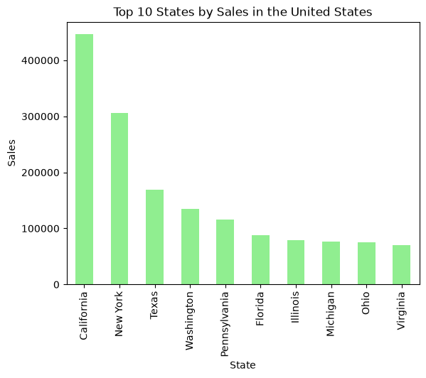
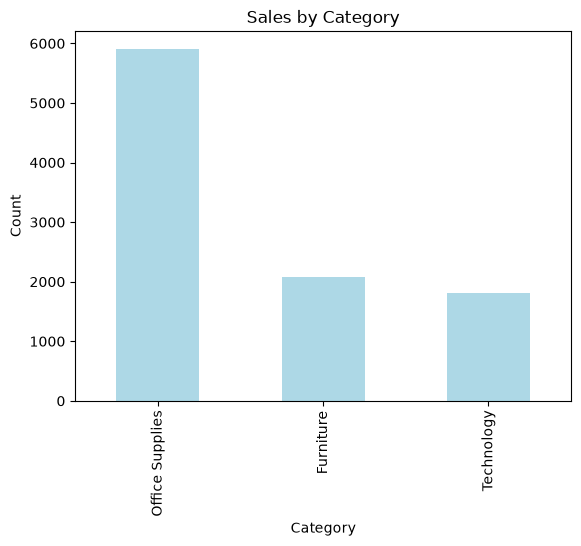
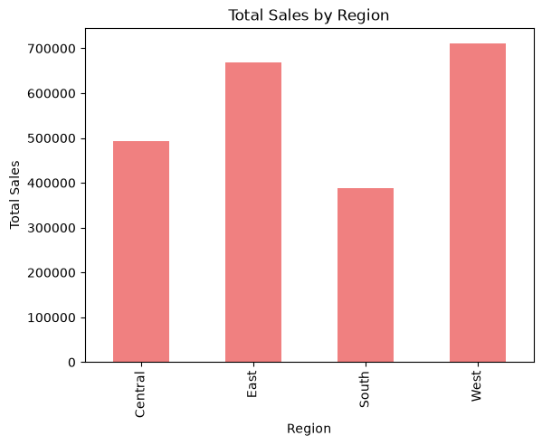
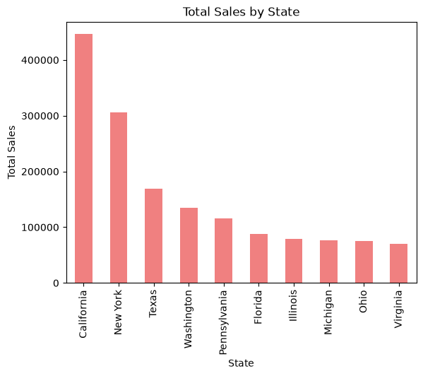
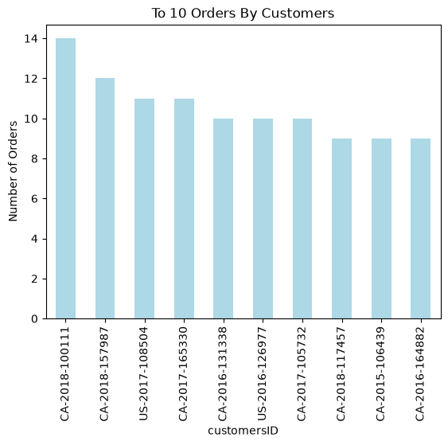
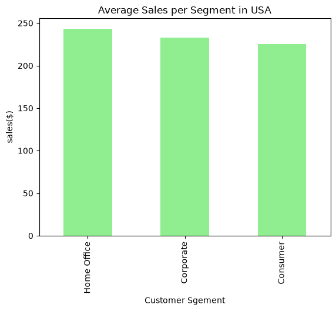

# Superstore Sales — Exploratory Data Analysis

Exploratory Data Analysis (EDA) on the classic **Superstore** retail dataset, performed in a Jupyter Notebook using Python. The project covers data cleaning, and visual analysis of sales across categories, regions, states, and customer segments.

## 📊 Project Overview

The goal of this project was to clean and explore a retail transactions dataset to answer key business questions such as:
- Which product categories generate the highest sales?
- Which U.S. states and regions contribute the most revenue?
- What are the top-ordering customers?
- How does average sales value differ across customer segments?

## 🗂️ Dataset

- **File:** `train.csv` (Superstore sales dataset)
- **Shape:** 9,800 rows × 18 columns
- **Key columns:** `order_id`, `order_date`, `ship_date`, `ship_mode`, `customer_name`, `segment`, `country`, `city`, `state`, `region`, `category`, `sub-category`, `product_name`, `sales`
- **Date range:** January 2015 – December 2018

## 🧹 Data Cleaning Steps

1. Loaded the dataset with pandas and made a working copy
2. Standardized column names (lowercase, stripped whitespace, underscores instead of spaces)
3. Dropped the redundant first index column
4. Checked for and removed duplicate rows (1 duplicate found and removed)
5. Checked for missing values (11 missing `postal_code` entries found)
6. Converted `order_date` and `ship_date` columns to proper datetime format

## 🔍 Analysis & Visualizations

- Top 10 highest-selling products within the Furniture category
- Top 10 most recent orders by order date

**Top 10 States by Sales (United States)**


**Sales Count by Category**


**Total Sales by Region**


**Total Sales by State**


**Top 10 Customers by Number of Orders**


**Average Sales per Segment (United States)**


## 🛠️ Tools & Libraries

- Python 3
- pandas
- numpy
- matplotlib

## ▶️ How to Run

1. Clone this repository
   ```bash
   git clone <https://github.com/Young1-developer/Superstore-Sales-EDA>
   cd <Superstore-Sales-EDA>
   ```
2. Install the required libraries
   ```bash
   pip install pandas numpy matplotlib
   ```
3. Place `train.csv` in the project folder
4. Open and run the notebook
   ```bash
   jupyter notebook project1.ipynb
   ```
   or open it in VS Code with the Jupyter extension.

## 📌 Key Takeaways

- A small number of duplicate and missing values were identified and handled during cleaning
- Sales are concentrated in specific states and regions, highlighting geographic opportunities
- Certain customer segments show consistently higher average order values
- A handful of customers place a disproportionately high number of orders

---
*This project was built as a hands-on exercise in data cleaning and exploratory data analysis with Python.*
